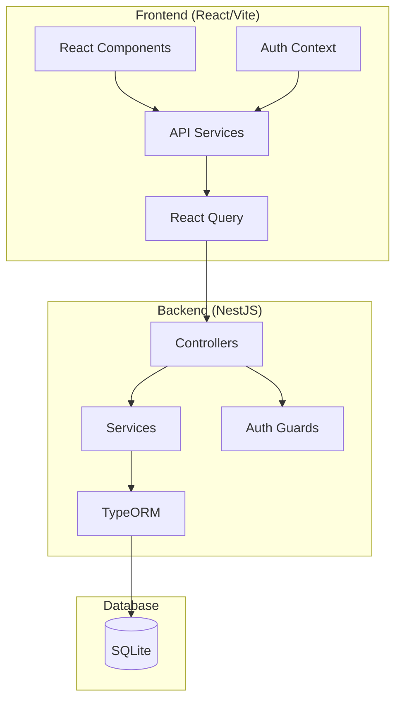
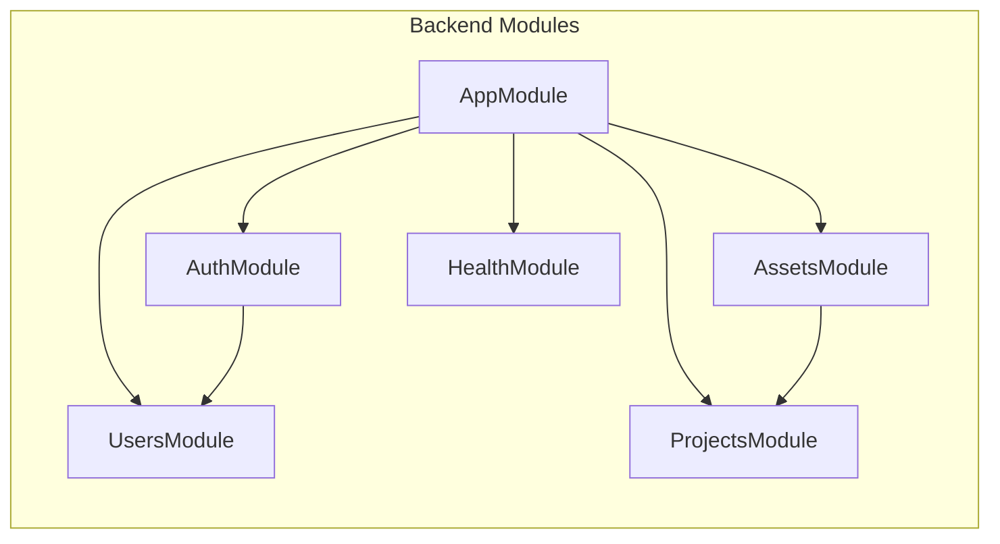
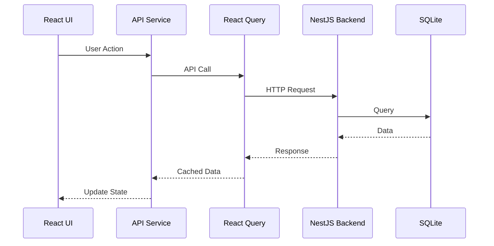
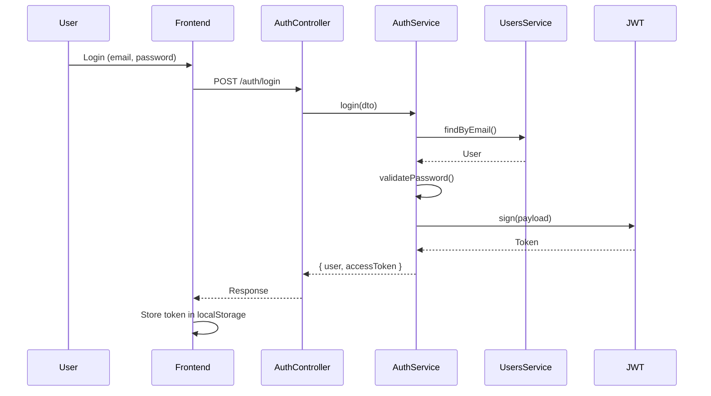

# Architecture Overview

This document provides an overview of the Corticon Rules Management System architecture.

## System Architecture

## Module Structure

## Data Flow

## Authentication Flow

## Technology Stack

| Layer | Technology | Purpose |
|-------|-----------|---------|
| Frontend | React 18 | UI Framework |
| Frontend | TypeScript | Type Safety |
| Frontend | Vite | Build Tool |
| Frontend | KendoUI React | UI Components |
| Frontend | React Query | Server State |
| Frontend | Axios | HTTP Client |
| Backend | NestJS | API Framework |
| Backend | TypeORM | ORM |
| Backend | Passport JWT | Authentication |
| Database | SQLite | Data Storage |
| Testing | Playwright | E2E Testing |
