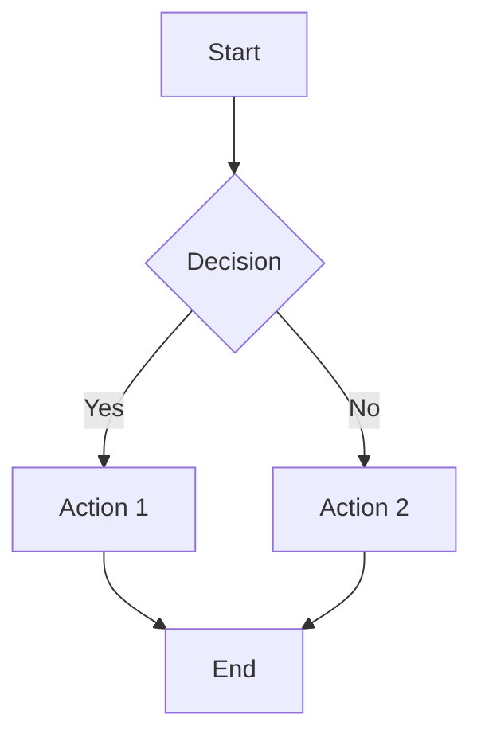
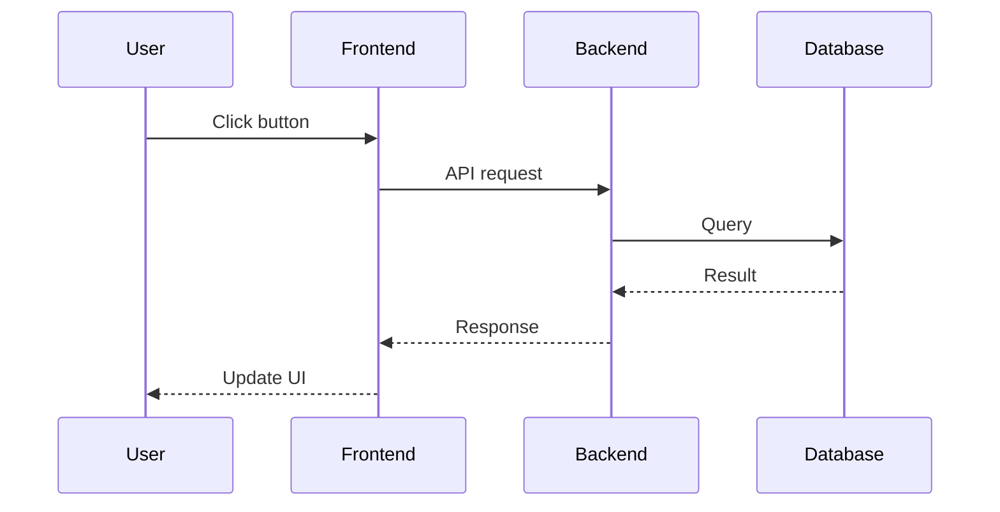
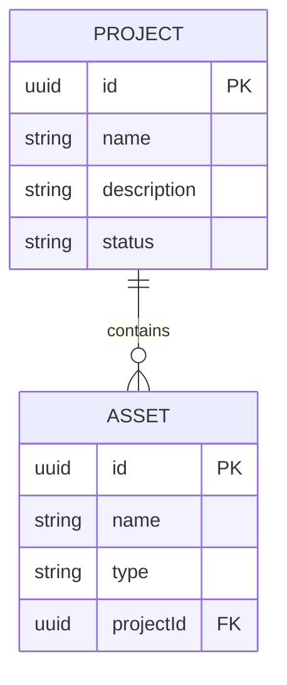
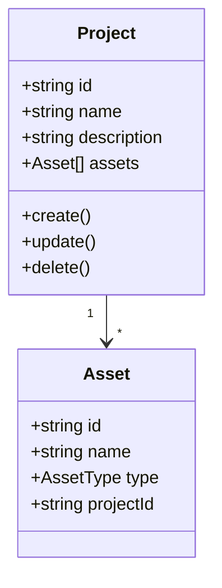

# Diagram Guidelines with Mermaid

This project uses Mermaid syntax for all diagrams.

## Why Mermaid?

- Text-based, version control friendly
- Renders in GitHub, VS Code, and documentation tools
- Easy to maintain and update
- No external tools required

## Common Diagram Types

### Flowchart

### Sequence Diagram

### Entity Relationship Diagram

### Class Diagram

## VS Code Extensions

Install these extensions for better Mermaid support:

1. **Markdown Preview Mermaid Support** - Preview Mermaid in Markdown
2. **Mermaid Markdown Syntax Highlighting** - Syntax highlighting

## Best Practices

1. Keep diagrams simple and focused
2. Use consistent naming conventions
3. Add comments for complex logic
4. Store diagrams in Documentation folder
5. Reference diagrams in related documentation
