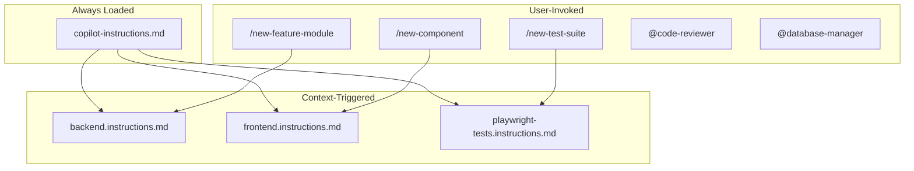

# GitHub Copilot Six Primitives Structure

This document explains how the Corticon project uses GitHub Copilot's Six Primitives model for 
AI-assisted development.

## Overview



## The Six Primitives

### 1. Always-on Instructions
**Location**: `.github/copilot-instructions.md`  
**Loaded**: Every request

Contains global rules that apply everywhere:
- Windows command syntax requirements
- Build process (backend before frontend)
- Directory structure
- Documentation standards

### 2. File-based Instructions
**Location**: `.github/instructions/*.instructions.md`  
**Loaded**: When editing matching files

| File | Applies To | Purpose |
|------|-----------|---------|
| `backend.instructions.md` | `Webapp/backend/src/**/*.ts` | NestJS patterns |
| `frontend.instructions.md` | `Webapp/frontend/src/**/*.{ts,tsx}` | React/KendoUI patterns |
| `playwright-tests.instructions.md` | `Webapp/frontend/tests/**/*.ts` | E2E test patterns |

### 3. Prompts
**Location**: `.github/prompts/*.prompt.md`  
**Invoked**: Type `/promptname` in chat

| Prompt | Description |
|--------|-------------|
| `/new-feature-module` | Generate complete NestJS module |
| `/new-component` | Generate React component with KendoUI |
| `/new-test-suite` | Generate Playwright test file |
| `/new-documentation` | Create feature documentation |

### 4. Skills (Not Yet Implemented)
**Location**: `.github/skills/*/SKILL.md`  
**Loaded**: When description matches user intent

Future skills could include:
- Database migration generator
- API documentation generator
- Performance optimization advisor

### 5. Custom Agents
**Location**: `.github/agents/*.md`  
**Invoked**: Type `@agentname` in chat

| Agent | Description |
|-------|-------------|
| `@code-reviewer` | Review code for best practices |
| `@database-manager` | Handle database operations |

### 6. MCP (Model Context Protocol)
**Location**: `.vscode/mcp.json`  
**Loaded**: Session start

Currently not configured. Could be used for:
- External API integrations
- Custom tool servers
- Database query tools

## Usage Examples

### Creating a New Feature

```
User: /new-feature-module

I need a "rules" module with:
- name (string, required)
- version (string)
- status (enum: draft, published, archived)
- project relation
```

### Code Review

```
User: @code-reviewer

Please review the changes in src/projects/projects.controller.ts
```

### Database Operations

```
User: @database-manager

I need to reset the database and seed with fresh test data
```

## Best Practices

1. **Keep always-on instructions focused** - Only global rules
2. **Use file-based for specifics** - Technology-specific patterns
3. **Create prompts for workflows** - Repeatable multi-step tasks
4. **Use agents for expertise** - Domain-specific knowledge
